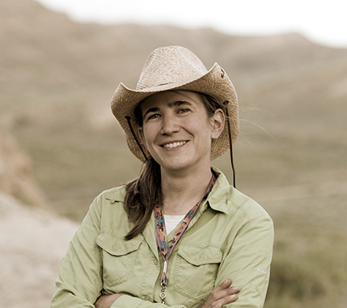
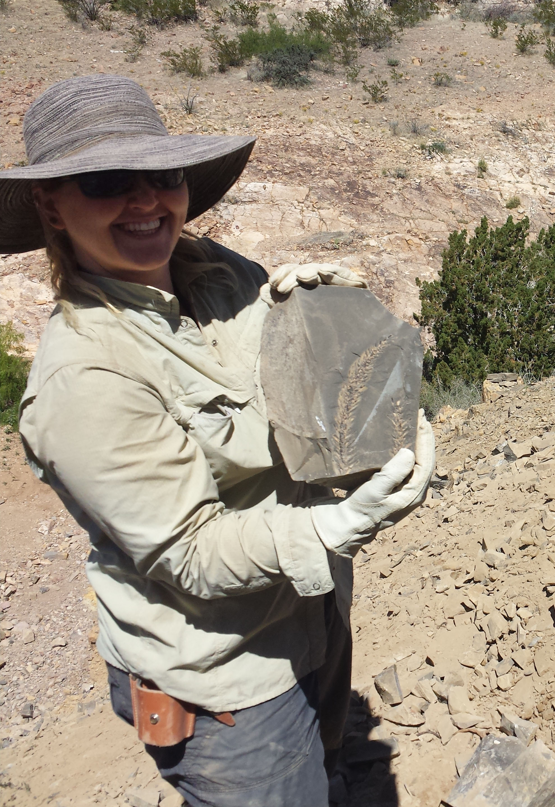
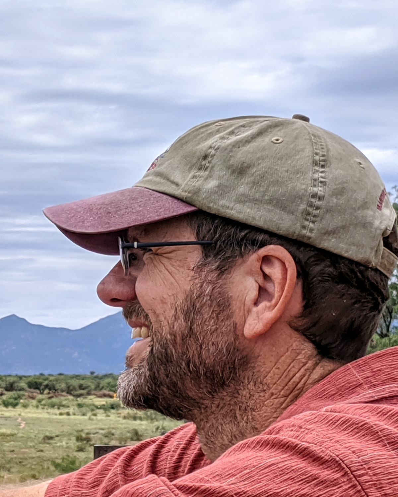

### Core Team
[Ellen Currano](https://www.uwyo.edu/geolgeophys/people/faculty/ellen-currano.html), University of Wyoming, Paleobotany, PI  
[Dori Contreras](https://www.perotmuseum.org/researchers/), Perot Museum of Nature and Science, Paleobotany, co-PI  
[Andrew Zaffos](https://azgs.arizona.edu/about/staff), Arizona Geological Survey, Geoinformatics and Paleontology Databases, co-PI  
[Claire Cleveland](https://sites.psu.edu/clairecleveland/), Paleontology & Workflow Management  
[Douglas Meredith](https://azgs.arizona.edu/about/staff), Arizona Geological Survey, Software Development  
Shanan Peters, University of Wisconsin, Paleobiology Database Integration, co-PI  
[Mark D. Uhen](http://uhenlab.weebly.com/), George Mason University, Paleobiology Database Integration, co-PI

### PBot Alumni
Matt Butrim, University of Wyoming  
Rebecca Koll, University of Exeter

### Governance Structure 
All PBot decisions are currently made by our Core Team. In the future, PBot will transition governance to a Leadership Panel, who will be responsible for oversight of infrastructure, maintenance, budgeting, and expansion. Participation in the Leadership Panel will be incentivized through unique opportunities for authorship in collaborative works, inclusion in large, collaborative grant proposals, and professional networking.
