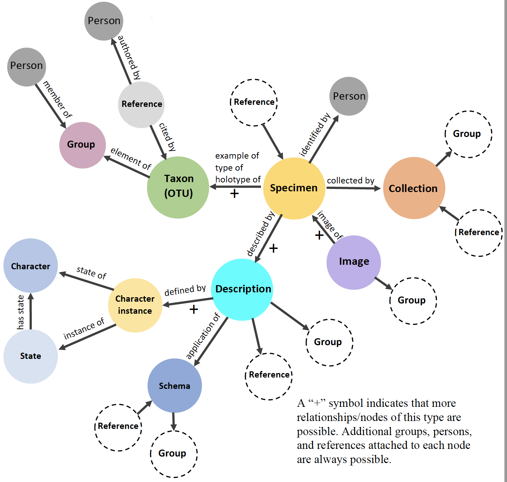
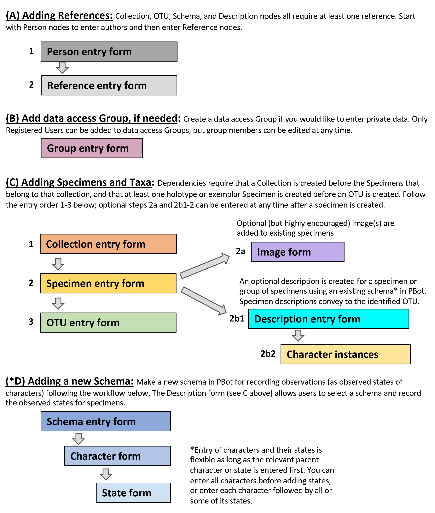

# How to Use PBot
Download the full PBot "How to Guide" here, or access individual Data Entry Cheat Sheets for each data element: 
[Register](Register.md)&nbsp;&nbsp;&nbsp;&nbsp;
[Person](Person.md)&nbsp;&nbsp;&nbsp;&nbsp;
[Group](Group.md)&nbsp;&nbsp;&nbsp;&nbsp;
[Reference](Reference.md)&nbsp;&nbsp;&nbsp;&nbsp;
[Collection](Collection.md)&nbsp;&nbsp;&nbsp;&nbsp;
[Specimen](Specimen.md)&nbsp;&nbsp;&nbsp;&nbsp;
[Image](Image.md)&nbsp;&nbsp;&nbsp;&nbsp;
[Description](Description.md)&nbsp;&nbsp;&nbsp;&nbsp; 
[Operational Taxonomic Unit](OTU.md)&nbsp;&nbsp;&nbsp;&nbsp;
[Schema](Schema.md)&nbsp;&nbsp;&nbsp;&nbsp;
[Character](Character.md)&nbsp;&nbsp;&nbsp;&nbsp;
[State](State.md)&nbsp;&nbsp;&nbsp;&nbsp;
[Synonym](Synonym.md)&nbsp;&nbsp;&nbsp;&nbsp;
[Comment](Comment.md) 

Here are guidance documents for [searching PBot data](Explore.md) and [entering published data](PublishedData.md) data, as well as [PBot Pro Tips](ProTips.md).

# The PBot Homepage
From the PBot homepage, selecting "Explore Fossil Plants" takes you to PBot Explore, our search portal. No login is required, and users can search or browse all publicly accessible data. Selecting "Go to Workbench" takes you to the PBot Workbench, where registered users can enter paleobotanical data that is either accessible to all or stored in a private group and accessible only to chosen registered users. Clicking the hamburger (☰) in the upper left of your screen allows you to easily move between Explore and Workbench, as well as to access informational materials. Clicking on the robot icon in the top header will return you to the PBot homepage.

# A Brief Overview of the PBot Architecture
PBot utilizes a graph database that consists of nodes and relationships. Each data entry form corresponds to a data object called a **“node”** in the PBot database. Nodes store the data entered into each field on a form as properties of the node. Defined relationships between nodes enable information to flow between nodes. The conceptual diagram below shows the full PBot architecture, with nodes as circles and relationships as arrows. 
 

# PBot Data Entry Workflow 
To begin data entry, first enter the PBot Workbench (login required). Next, use the menu on the left side of the screen to select a node type. A data entry form will now be visible. At the top of the data entry form, you can see buttons to create (plus sign), edit (pencil icon), or delete (minus sign) a node.

The major data elements (the color coded boxes) are entered in PBot in the order outlined below. In many cases, you may start at different points in the workflow, or only enter select data elements as needed, as long as any required supporting required data (e.g., references) have been entered first. Follow steps A through C, with D (schema building) being a special case scenario.  

