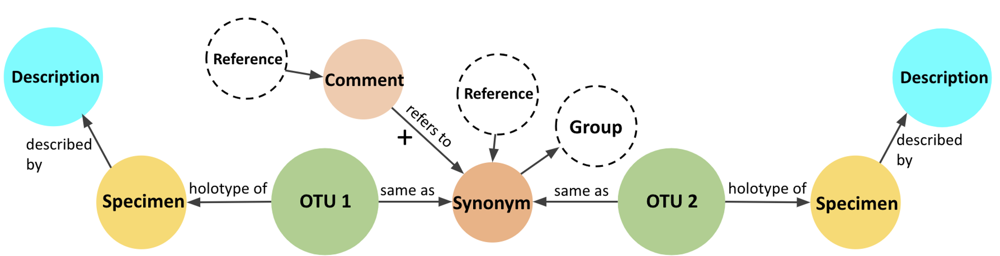

# Synonym Node
## Instructions for data entry
One of our favorite PBot capabilities is being able to compare OTUs from different sites, time periods, and research groups. And in doing so, it is possible to recognize when different names are being used to refer to the same taxon and to propose **synonymies** between OTUs. We use the term **Synonymy** in a slightly less formal sense than the strict taxonomic definition, but the essence is the same- to denote a relationship between OTUs that were given different names but are thought to represent the same taxon. The Synonymy feature is a work in progress and will undergo significant upgrades in our next funding cycle. 
 
 
 
 
 
 
 
 
The current implementation of the “synonymy” feature creates a link between two or more existing OTUs and allows the enterer to add comments explaining why the OTUs are being linked and add supporting references for those actions. The OTUs that are linked retain their independent OTU pages, and all specimens remain assigned to their original OTU. The proposed synonymy displays on each of the OTU's pages. Any user can add additional tracked comments to the proposed synonymy, or existing comments, to facilitate dialog. 

What it DOES NOT do: Proposing a synonymy does not merge the data from the linked OTUs. No data is lost or irreversibly migrated by a synonymy event. 

## WHEN TO SYNONYMIZE:
In the current PBot functionality, information about Synonyms can be viewed at the bottom of the OTU page, under the Synonym accordion. However, the synonym relationship is not incorporated into search functions yet (this is one of our top priorities for PBot v2.0). For example, if you search for all OTUs from a time interval, you will see both OTUs listed separately. Given the current constraints of PBot, we provide these recommendations for when to create distinct OTUs and a synonym relationship between them, versus assigning specimens to an existing OTU:
*	If you are very confident that a specimen you are entering belongs to an OTU that already exists in PBot, we strongly encourage you to assign that specimen to the existing OTU, rather than create a new OTU and a Synonym. To do this in your workbench, navigate to OTU entry form, select the edit icon, and then search and select the existing OTU.  Add your new specimen(s) as an “Identified specimen” and press submit. Now your new specimens will appear on the OTU page as additional occurrences of the taxon.
*	If you are morphotyping a flora and have created two or more distinct OTUs that you later decide to lump together prior to publishing your work (and making your OTUs “public” in PBot), we strongly encourage you to reassign specimens such that only a single OTU exists. To do this, edit the OTU page for the OTU name that you plan to retain, adding all specimens as an “Identified specimen.” Then, delete the other OTU nodes.
* For published taxa that have been formally synonymized in the literature, particularly for long-accepted synonymizations, we suggest editing the affected OTUs to reflect the updated literature and to reassign affected specimens to the OTU that will be conserved in PBot (this would general be the one with taxonomic priority). To do this in your workbench, choose to edit the OTU that will be conserved, and edit its name, diagnosis, and text descriptions as needed, and check that the type specimens and other metadata and taxonomic fields are correct. Add the reference for the synonymy as the primary reference and explain the taxonomic history in the notes field. For the OTU(s) that are being synonymized, navigate to their pages to check that all pertinent data (such as in the notes field) has been copied to the priority OTU, and that all specimens have been reassigned, and then you may delete the now-defunct OTU.
*	In the case that you or another author is proposing that two published OTUs are the same, but the synonymization has not yet been validly published, simply create a Synonym node and provide the explanation for the proposed synonymy. Do not re-assign specimens or delete OTUs (unless the affected OTUs are part of your own unpublished work).
*	For whole-plant concepts that consist of multiple organ-specific named taxa, we recommend creating/maintaining separate OTUs for each formal taxonomic name (or organ) and synonymizing them. This allows other single-organ occurrences to still be assigned to the appropriate organ-specific OTU.
*	Currently in PBot, we recommend that OTUs named or identified using open nomenclature, such as “cf.”, “aff.”, or “sp.”, simply be entered as a unique OUT. It is up to the user’s discretion as to whether it is appropriate to create a proposed synonymy between such OTUs and established taxa.

## REQUIRED FIELDS: 
**Explanation** – A concise text explanation for the proposed synonymy.

**OTUs** – Select two OTUs that are proposed to be synonymous. Both OTUs must already exist in PBot. Currently, it is only possible to link two OTUs at a time, and so if a Synonym is proposed that links more than two OTUs, it is necessary to create pairwise links between all OTUs.

**Reference** – Select one or more References that state that the two OTUs represent a single entity and should be synonymized. References must already exist in PBot and can include unpublished references (temporary placeholders for personal workbenches and unpublished opinions). Multiple References can be associated with a Collection by clicking “ADD REFERENCE”. Enter the order number for the Reference to indicate its priority in the reference list, with the most relevant publication as order 1.

**Public or Group** – The default is for a Synonym to be Public, as published data and taxonomic opinions should always be part of the “Public” access group. If you would like to restrict access to an unpublished Synonym, uncheck “Public” and select which one or more of your private groups can access this Synonym. Once a record has been made public, it cannot be returned to a private group.
